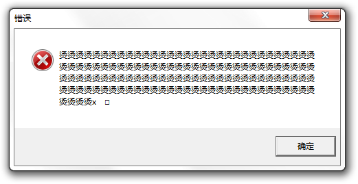

## 第二章 写的又快又好的秘诀

本章主要介绍了一些使得编写代码的过程能够兼顾速度和质量的方法论以及一些小技巧。

## 2.1 好与快的关系

传统上认为，写代码在开发效率和软件质量之间是成反比的。作者在本节提出，要首先提高软件代码的质量，这有助于在开发后期，节约大量“收拾之前的烂摊子”从而浪费掉的时间。因此，开发过程中的“好”与“快”是辩证统一、相辅相成的。所谓“磨刀不误砍柴工”，我们需要找到开发效率和软件质量之间的平衡点。

### 时间都去哪儿了？

我们知道，敲代码并不是花时间最多的地方。作者认为，耗费时间最多的地方有以下几方面，并提出了解决方案：

1. 分析

   设计是一个思考过程，需要耗费大量时间，因此需要熟悉各种设计模式和数据结构，才能熟能生巧。

   个人体会：一开始先不要着急写代码。先在纸上画画结构图，理清结构逻辑，梳理模块和函数分工，然后再开工。

2. 测试

   对于很短的程序我们可能使用输入-处理-输出的过程，但是如果需要测试的比较多就很浪费时间，尤其是在程序输入比较复杂的情况下。因此有必要使用自动化测试的方法。

3. 调试

   尽量一次性写好，少用调试器

## 2.2 代码阅读法

不要急着编译代码，先阅读一遍。

1. 第一遍先关注语法、排版、命名规则等问题。
2. 第二遍关注常见编程错误。e.g. 内存泄漏，越界访问 etc.
3. 模拟计算机执行，在心中模拟一遍程序逻辑，考虑各种边界条件
4. “小黄鸭编程法”，假装讲给朋友听，理清思路

## 2.3 避免常见错误

### 内存泄漏

在C/C++中，要记得回收内存

### 越界访问

`int array[10]` 说的是size是10，下标范围是从`array[0]` 到 `array[9]` ，试图访问`array[10]`就造成了越界访问。

### 野指针

被free掉的指针指向的地址，不可以再读写，否则可能导致脏数据产生。

**malloc和free的原理：**

调用`malloc() `,获得一个指向一片空内存的指针。注意分配的内存区域可能有脏数据。

```c
int* ptr = (int *)malloc(16 * sizeof(int))
```

```
+----------+        +------------------/ /---+
|   *ptr   +------> |  Memory space          |
+----------+        +------------------/ /---+
```

使用完之后进行释放

```c
free(ptr);
```

这一操作把ptr指向的内存块“还给”操作系统。但是注意此时ptr指针本身并没有被改变，它仍然指向之前的内存空间。

与此同时，操作系统可能将这片内存划给其他程序使用（因为通过调用`free()`释放了），如果此时继续使用ptr读写内存，将可能导致程序异常。

因此，释放内存后应该立即将指针置空：

```cpp
ptr = NULL; // C
ptr = nullptr; //C++11
```

```
+----------+        +------------------/ /---+
|   NULL   |        |  Memory space          |
+----------+        +------------------/ /---+
```

### 访问空指针

访问空指针会导致异常，从而使应用crash。但是这仍然好过让应用访问野指针，导致不可预期行为。

### 变量未初始化

除了全局变量和静态变量（会存储于.bss段中）以外，其他变量如果在声明时未制定初值，其值是不确定的（是脏数据），不能直接使用。



> 但是也有些编译器在Debug Build的时候会把内存填充为特定的数据，帮助开发者及早发现问题

### 返回指向临时变量的指针

进入函数时，局部变量分配在栈上，离开作用域时由OS回收。因此不可以返回指向栈上局部变量的指针。

对比以下两个函数：

```c
int main(void)
{
    char* p0 = get_str0();
    printf("%s\n",p0);
    char* p1 = get_str1();
    printf("%s\n",p1);
    return 0;
}

char* get_str0(void)
{
    char str[] = {"Hello, World!"};
    return str;
}

char* get_str1(void)
{
    char* str = {"Goodbye, World!"};
    return str;
}
```

`get_str0` 返回的是局部临时变量，因此是错误的。但是`get_str1` 是没有问题的。为什么？

#### `char str[]` 与 `char* str` 的区别

`char str[] = {"Hello, World!"};`定义了一个局部字符**数组**，尽管是数组，但它是一个局部变量，是分配在栈上的。当函数返回时，`str` 数组退化为字符指针（但是仍然指向局部变量）然后被返回。

```
  .      .
  .      .
. / .... /
H | 0x48 | 0x61fe02 == &str
e | 0x65 |
l | 0x6c |  // 这里是进入get_str1()时分配的栈内存，
l | 0x6c |  // 离开函数作用域时就会被回收
o | 0x6f |
. | .... |
. / .... /
  .      .
  .      .
```

而 `char* str = {"Goodbye, World!"};` 则定义了一个**指向字符串的指针**，指针本身在栈上，但指向了**静态储存区**中的字符串。

```
    .          .
  . /   ....   /
  H |   0x48   | 0x404000  <--+
  e |   0x65   |              |
  l |   0x6c   |              |
  l |   0x6c   |              |
  o |   0x6f   |              |
  . |   ....   |              |
  . /   ....   /              |
    .          .              |
                              |
                              |
    .          .              |
    |          |              |
str | 0x404000 | 0x61fe08  +--+
    |          |
    .          .
```

当函数返回时，`str` 指针的值（也就是静态区中字符串的地址）被返回，仍然指向有效的地址。

对比一下汇编：

```assembly
get_str0:
	push	rbp
	.seh_pushreg	rbp
	mov	rbp, rsp
	.seh_setframe	rbp, 0
	sub	rsp, 16
	.seh_stackalloc	16
	.seh_endprologue
	movabs	rax, 6278066737626506568
	mov	QWORD PTR -14[rbp], rax
	mov	DWORD PTR -6[rbp], 1684828783
	mov	WORD PTR -2[rbp], 33
	mov	eax, 0
	add	rsp, 16
	pop	rbp
	ret
	.seh_endproc
	.section .rdata,"dr"
.LC0:
	.ascii "Goodbye, World!\0"
	.text
	.globl	get_str1
	.def	get_str1;	.scl	2;	.type	32;	.endef
	.seh_proc	get_str1
get_str1:
	push	rbp
	.seh_pushreg	rbp
	mov	rbp, rsp
	.seh_setframe	rbp, 0
	sub	rsp, 16
	.seh_stackalloc	16
	.seh_endprologue
	lea	rax, .LC0[rip]
	mov	QWORD PTR -8[rbp], rax
	mov	rax, QWORD PTR -8[rbp]
	add	rsp, 16
	pop	rbp
	ret
```

一个有趣的事实是，如果打开 gcc 的 `-O2` 或 `-O3` 优化的话，`get_str0()` 会被直接优化为一个空函数：

```assembly
get_str0:
	.seh_endprologue
	xor	eax, eax
	ret
	.seh_endproc
	.p2align 4,,15
	.globl	get_str1
	.def	get_str1;	.scl	2;	.type	32;	.endef
	.seh_proc	get_str1
get_str1:
	.seh_endprologue
	lea	rax, .LC0[rip]
	ret
	.seh_endproc
```

