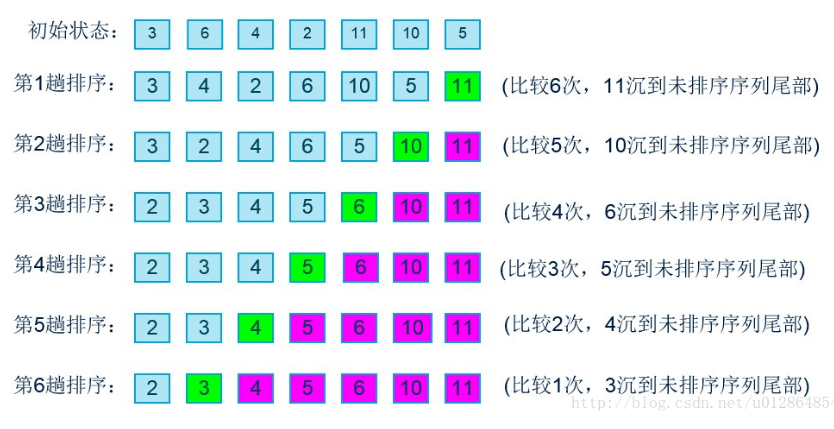
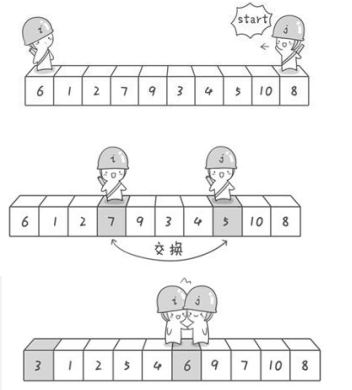
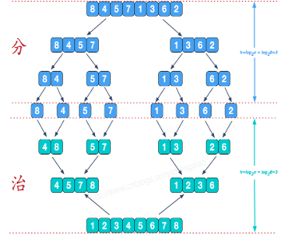

## 第三章 从动态数组学习设计

​	本章介绍了什么是动态数组、介绍了几种排序算法、最后介绍了两个有序数组的应用。

### 3.1动态数组与双向链表 

​	双向链表和动态数组是两种简单的数据结构，越是简单的结构越有广泛的应用。也正是由于这个原因，我们才选择双向链表和动态数组作为学习的载体。

#### 两个小问题

​	（1）思考双向链表和动态数组的特点及适用条件。（我们要为实际应用而学习 ）

​	（2）按前面在双向链表中学习到的方法实现动态数组。

### 双向链表和动态数组的对比

​	在C语言中，数组的长度是事先确定的。

​	 **动态数组**：长度可以根据存储数据多少自动调整，这需要我们用程序来实现。

**双向链表和动态数组对比**

​	1、数据占用**内存**是否连续。频繁增删数据，双向链表更容易造成内存碎片。

​	2、**增删操作**差异。动态数组的增删操作需要移动后面的元素；链表只需修改指针。

​	3、动态数组支持多种高效的**排序算法**。像快速排序、归并排序和堆排序等等。

​	4、有序的动态数组可以**二分查找**。双向链表实现不了，因为不支持随机定位。

​	5、小量数据，二者区别不大。

###  动态数组的实现

​	借助标准C的内存管理函数**realloc**。

​	如果每插入/删除一个元素就要realloc 一次，不但会带来性能的下降，而且可能造成内存碎片。为了解决此问题，我们采用**预先分配**（空间换时间）。

#### 扩展空间

​	根据以往的经验，扩展为现有元素个数的1.5倍。

```c
#define MIN_PRE_ALLOCATE_NR 10
static Ret darray_expand(DArray* thiz, size_t need) 
{    
    return_val_if_fail(thiz != NULL, RET_INVALID_PARAMS);
    if((thiz->size + need) > thiz->alloc_size)
    {        
        size_t alloc_size = thiz->alloc_size + (thiz->alloc_size>>1) + MIN_PRE_ALLOCATE_NR;
        void** data = (void**)realloc(thiz->data, sizeof(void*) * alloc_size); 
        if(data != NULL)
        {            
            thiz->data = data; 
            thiz->alloc_size = alloc_size;
        } 
    }    
    return ((thiz->size + need) <= thiz->alloc_size) ? RET_OK : RET_FAIL;
}
Ret darray_insert(DArray* thiz, size_t index, void* data)
{
	Ret ret = RET_OOM; size_t cursor = index;
	return_val_if_fail(thiz != NULL, RET_INVALID_PARAMS);
    
    cursor = cursor < 	thiz->size ? cursor : thiz->size;
    
    if(darray_expand(thiz, 1) == RET_OK)
	{
	size_t i = 0;
		for(i = thiz->size; i > cursor; i--)
		{
		thiz->data[i] = thiz->data[i-1];
		}
		thiz->data[cursor] = data; thiz->size++;
		ret = RET_OK;
	}
	return ret;
}

```

```C
typedef enum _Ret
{
	RET_OK,
	RET_OOM,
	RET_STOP,
	RET_INVALID_PARAMS,
	RET_FAIL
}Ret;
```

​	在实际应用中，有的变量只有几种可能取值。如人的性别只有两种可能取值，星期只有七种可能取值。在 C 语言中对这样取值比较特殊的变量可以定义为**枚举类型**。

​	所谓枚举是指将变量的值一一列举出来，变量只限于列举出来的值的范围内取值。  

```c
size_t alloc_size = (thiz->alloc_size + thiz->alloc_size>>1) + MIN_PRE_ALLOCATE_NR;
```

​	计算 1.5*thiz->alloc_size 时，我们不使用 1.5 * thiz->alloc_size，因为这样存在浮点数计算， 在大多数嵌入式平台中，都没有硬件浮点数计算的支持，浮点数的计算比定点数的计算要慢上百倍。

​	也不使用 thiz->alloc_size+ thiz->alloc_size/2，如果编译器不做优化，除法指令也是比较慢的操作，特别是像在 ARM 这种没有除法指令的芯片中，需要很多条指令才能实现除法的计算。

​	后面加上MIN_PRE_ALLOCATE_NR 的原因是避免 thiz->alloc_size 为 0 时存在的错误。

#### 减小空间

​	在删除元素时也不是马上释放空闲空间，而是等到空闲空间高于某个值时才释放它们。这里我们的做法是，**空闲空间多于有效空间一倍**（有效空间 小于 分配总空间的一半）时，将总空间调整为有效空间的 1.5 倍。

```c
static Ret darray_shrink(DArray* thiz)
{    
    return_val_if_fail(thiz != NULL, RET_INVALID_PARAMS); 
    if((thiz->size < (thiz->alloc_size >> 1)) && (thiz->alloc_size > MIN_PRE_ALLOCATE_NR))
    {        
        size_t alloc_size = thiz->size + (thiz->size >> 1);
        void** data = (void**)realloc(thiz->data, sizeof(void*) * alloc_size); 
        if(data != NULL) 
        { 
            thiz->data = data; 
            thiz->alloc_size = alloc_size;
        } 
    }  
    return RET_OK;
}
Ret darray_delete(DArray* thiz, size_t index)
{    
    size_t i = 0; 
    Ret ret = RET_OK;  
    return_val_if_fail(thiz != NULL && thiz->size > index, RET_INVALID_PARAMS); 
    darray_destroy_data(thiz, thiz->data[index]); 
    for(i = index; (i+1) < thiz->size; i++) 
    {        
        thiz->data[i] = thiz->data[i+1];  
    }    
    thiz->size--;    
    darray_shrink(thiz);  
    return RET_OK;
}

```

​	为了避免极端情况下的出现频繁 resize 的情况，在总空间小于等于MIN_PRE_ALLOCATE_NR 时，我们不减少空间的大小。

### 3.2排序

​	大多数高级排序算法都是针对数组实现的。

​	最重要的是要从中学习一些**思考问题的方法**。对比不同算法的**特点**，也有助于我们在设计时做出正确的选择。

​	 **要求** ：

​	（1）同时支持升序排序和降序排序。

​	（2）算法同时支持多种数据类型。 

​	 **实现**：

​	利用**回调函数**！

​	 **原型**：

```c
typedef int (*DataCompareFunc)(void* ctx, void* data); 
```

​	 **升序比较函数**:

```c
int int_cmp(void* a, void* b) 
{    
    return (int)a - (int)b;
}

```

​	 **降序比较函数**:

```c
int int_cmp_invert(void* a, void* b)
{   
    return (int)b - (int)a; 
}

```

​	比较函数也不依赖于具体的数据类型，这样我们就把算法的变化部分独立出来了。是升序还是降序完全由回调函数决定。下面我们看看算法的具体实现。

### 冒泡排序

​	名字很形象的表达了算法的原理，对于降序排列时，排序可以认为是轻的物体不断往上浮的过程。

​	 **升序排列更符合人类的思考方式**，这里我们按升序排序来实现冒泡排序(通过使用不同的比较函数， 同样支持降序排序)。

```c
Ret bubble_sort(void** array, size_t nr, DataCompareFunc cmp) 
{   size_t i     = 0; 
 	size_t max   = 0; 
 	size_t right = 0;
    return_val_if_fail(array != NULL && cmp != NULL, RET_INVALID_PARAMS); 
 	if(nr < 2) 
    {        
        return RET_OK; 
    }   
 	for(right = nr - 1; right > 0; right--)  
    {        
        for(i = 1, max = 0; i < right; i++) 
        {         
            if(cmp(array[i], array[max]) > 0) 
            {        
                max = i; 
            }      
        }      
        if(cmp(array[max], array[right]) > 0)   
        {        
            void* data = array[right];     
            array[right] = array[max];    
            array[max] = data;     
        }   
    }   
 return RET_OK; 
}
```



​	冒泡排序是最简单直观的排序算法,从性能上来看， 与其它高级排序算法相比，它似乎没有存在的理由。

​	为什么**冒泡排序依然存在**？原因有两点： 

​	（1）**实现简单，简单的程序通常更可靠。**

​	作者写道：虽然我很多年没有写过冒泡排序算法了，从写代码、编译到测试，都一次性通过了。写快速排序时却出了好几次错误， 而且最后参考了教科书才完成。

​	（2）**在小量数据时，所有排序算法性能差别不大。**

​	有文章指出，高级排序算法在元素个数多于1000 时，性能才出现显著提升。在 90%的情况下，我们存储的元素个数只有几十到上百个而已，比如进程数、窗口个数和配置信息等等的数量都不会很大，冒泡排序其实是更好的选择。

### 快速排序

​	快速排序当然是以其性能优异出名了，而且它**不需要额外的空间**。

​	如果**数据量大而且全部在内存中时**，快速排序是首选的排序方法。排序过程是先将元素分成两个区，所有小于某个 元素的值在第一个区，其它元素在第二区。然后分别对这两个区进行快速排序，直到所**分区**只剩下一个元素为止。

```c
void quick_sort_impl(void** array, size_t left, size_t right, DataCompareFunc cmp) 
{
    size_t save_left  = left; 
    size_t save_right = right;  
    void* x = array[left];   
    while(left < right)   
    {        
        while(cmp(array[right], x) >= 0 && left < right) right--;    
        if(left != right)  
        {           
            array[left] = array[right];    
            left++;   
        }      
        while(cmp(array[left], x) <= 0 && left < right) left++;  
        if(left != right)    
        {           
            array[right] = array[left];
            right--;   
        }    
    }   
    array[left] = x;   
    if(save_left < left)   
    {       
        quick_sort_impl(array, save_left, left-1, cmp);  
    }   
    if(save_right > left)   
    {    
        quick_sort_impl(array, left+1, save_right, cmp);   
    }   
    return; 
} 
Ret quick_sort(void** array, size_t nr, DataCompareFunc cmp)
{    
    Ret ret = RET_OK; 
    return_val_if_fail(array != NULL && cmp != NULL, RET_INVALID_PARAMS); 
    if(nr > 1)  
    {      
        quick_sort_impl(array, 0, nr - 1, cmp);   
    }   
    return ret;
}

```



​	 **战胜软件复杂度**是《系统程序员成长计划》的中心思想之一。战胜软件复杂度包括**防止复杂度增长**和**降低复杂度**两个方面。降低复杂度的方法主要有**抽象**和**分而治之**两种，快速排序则是分而治之的具体体现。	

### 归并排序

​	与快速排序一样，归并排序也是分而治之的应用。不同的是，它**先让左右两部分进行排序， 然后把它们合并起来**。

​	 <u>快速排序</u>可以认为是<u>自顶向下</u>的方法，而**归并排序**可以认为是**自底向上**的方法。

```c
static Ret merge_sort_impl(void** storage, void** array, size_t low, size_t mid, size_t high, DataCompareFunc cmp)
{    
    size_t i = low;  
    size_t j = low;   
    size_t k = mid; 
    /*左半部分排序*/
    if((low + 1) < mid)  
    {        
        size_t x = low + ((mid - low) >> 1);   
        merge_sort_impl(storage, array, low, x, mid, cmp);  
    } 
    /*右半部分排序*/
    if((mid + 1) < high)  
    {      
        size_t x = mid + ((high - mid) >> 1); 
        merge_sort_impl(storage, array, mid, x, high, cmp); 
    }
    /*合并两个有序数组*/
    while(j < mid && k < high)  
    {       
        if(cmp(array[j], array[k]) <= 0)  
        {         
            storage[i++] = array[j++];   
        }     
        else 
        {    
            storage[i++] = array[k++];   
        }  
    }  
    while(j < mid)  
    {      
        storage[i++] = array[j++];  
    }    
    while(k < high)  
    {       
        storage[i++] = array[k++];
    }   
    for(i = low; i < high; i++)   
    {        
        array[i] = storage[i];  
    }   
    return RET_OK;
} 

Ret merge_sort(void** array, size_t nr, DataCompareFunc cmp) 
{   
    void** storage = NULL; 
    Ret ret = RET_OK;   
    return_val_if_fail(array != NULL && cmp != NULL, RET_INVALID_PARAMS);  
    if(nr > 1)  
    {    
        storage = (void**)malloc(sizeof(void*) * nr);  
        if(storage != NULL)   
        {
            ret = merge_sort_impl(storage, array, 0, nr>>1, nr, cmp);   
            free(storage);    
        }   
    }  
    return ret;
}

```



​	归并排序需要**额外的存储空间**，这部分空间为被排序的数组一样大。大部分示例代码里，都在每次递归调用中分配空间，这些会带来性能上的下降。这里我们选择了**预分配**一块空间，在排序过程中重复使用，算法更简单，性能也得到提高。 

​	根据把要排序的数组分成N个部分，可以把归并排序称为N路排序。上面实现的归并排序 实际是归并算法一个特例：**两路归并**。

​	归并排序更重要的能力在于**处理大量数据的排序**，它不要求被排序的数据全部在内存中。归并排序最常用的地方是**数据库管理系统(DBMS)**，因为数据库中存储的数据通常无法全部加载到内存中来的。

###  排序算法的测试

​	排序算法的**实现不同**，但它们的**目的一样**：让数据处于有序状态。

​	在写自动测试时， 没有必要为每一种算法写一个测试程序。通过**将排序算法作为回调函数传入**，我们可以共用 一个测试程序：

```c
static void** create_int_array(int n)  //3
{  
    int i = 0; 
    int* array = (int*)malloc(sizeof(int) * n); 
    for(i = 0; i < n; i++) 
    {      
        array[i] = rand(); 
    }    
    return (void**)array;
} 
static void sort_test_one_asc(SortFunc sort, int n)  //2
{   
    int i = 0;    
    void** array = create_int_array(n);  
    sort(array, n, int_cmp);   
    /*检查数组是否有序*/
    for(i = 1; i < n; i++)   
    {        
        assert(array[i] >= array[i-1]); 
    }   
    free(array); 
    return; 
} 
void sort_test(SortFunc sort)  //1
{   
    int i = 0;  
    for(i = 0; i < 1000; i++)
    {      
        sort_test_one_asc(sort, i); 
    }  
    return ;
}

```

​	 **assert**宏的原型定义在<assert.h>中，其作用是**如果它的条件返回错误，则终止程序执行**，原型定义： 

```c
#include <assert.h>
void assert( int expression );
```

​	assert的作用是现计算表达式 expression ，如果其值为假（即为0），那么它先向stderr打印一条出错信息，然后通过调用 abort 来终止程序运行。 

​	 **assert用法总结与注意事项:** 

1）在函数开始处检验传入参数的合法性如：

```
int resetBufferSize(int nNewSize)
{
　　//功能:改变缓冲区大小,
　　//参数:nNewSize 缓冲区新长度
　　//返回值:缓冲区当前长度 
　　//说明:保持原信息内容不变     nNewSize<=0表示清除缓冲区
　　assert(nNewSize >= 0);
　　assert(nNewSize <= MAX_BUFFER_SIZE);
　　...
}
```

　　2）每个assert只检验一个条件，因为同时检验多个条件时，如果断言失败，无法直观的判断是哪个条件失败，如：

　　不好：

```
assert(nOffset>=0 && nOffset+nSize<=m_nInfomationSize);
```

　　好：

```
assert(nOffset >= 0);
assert(nOffset+nSize <= m_nInfomationSize);
```

　　3）不能使用改变环境的语句，因为assert只在DEBUG生效，如果这么做，会使用程序在真正运行时遇到问题，如：

　　错误：

```
assert(i++ < 100);
```

　　这是因为如果出错，比如在执行之前i=100，那么这条语句就不会执行，那么i++这条命令就没有执行。

　　正确：

```
 assert(i < 100);
 i++;
```

　　4）assert和后面的语句应空一行，以形成逻辑和视觉上的一致感。
　　5）有的地方，assert不能代替条件过滤。

​	 **assert是用来避免显而易见的错误的，而不是处理异常的**。错误和异常是不一样的，错误是不应该出现的，异常是不可避免的。c语言异常可以通过条件判断来处理，其它语言有各自的异常处理机制。  

​	一个非常简单的使用assert的规律就是，**在方法或者函数的最开始使用**，如果在方法的中间使用则需要慎重考虑是否是应该的。 

### 集成排序算法到动态数组中

​	把排序算法集中到动态数组并**不合适**，原因有：

​	(1)绑定动态数组与特定算法不如让用户根据需要去选择。 

​	(2)在动态数组中实现排序算法不利于算法的重用。 

​	所以我们给动态数组增加一个排序函数，但排序算法通过回调函数传入：

```c
Ret    darray_sort(DArray* thiz, SortFunc sort, DataCompareFunc cmp);
```

### 3.3有序数组的两个应用

​	通常我们对数组排序不是为了排序而排序，而是为了其它的用途才排序的。

### 二分查找

​	二分查找也称为折半查找，它的前提是数组中的元素是**有序**的。

​	算法过程如下(假定数组为升序)：先拿要查找的元素与数组中间位置的元素相比较，如果小 于则在数组的前半部分查 找，大于则在数组的后半部分查找，相等则在找到了。重复这个过程直到找到或者数组被分成单个元素为止。

```c
int qsearch(void** array, size_t nr, void* data, DataCompareFunc cmp)
{   
    int low    = 0; 
    int mid    = 0; 
    int high   = nr-1; 
    int result = 0; 
    return_val_if_fail(array != NULL && cmp != NULL, -1);  
    while(low <= high)    
    {      
        mid  = low + ((high - low) >> 1);
        result = cmp(array[mid], data);  
        if(result == 0)  
        {            
            return mid;   
        }        
        else if(result < 0) 
        {           
            low = mid + 1;  
        }      
        else    
        {
            high = mid - 1; 
        }  
    }   
    return -1;
}

```

​	 **注意**：

​	（1）计算中间位置的方法。

​	这里使用mid = low + ((high - low) >> 1)代替(low+hign)/2，目的是为 了**避免整数溢出和除法计算**。 

​	（2）边界值问题。

​	在编写排序和查找的程序时，最容易犯边界值错误，写程序时一定要保持思路清晰。

### 去除重复元素 

​	在工作中，我经常使用**linux中的命令sort和uniq的组合**。**uniq的功能是去除重复的元素， 它的前提也是要求数据是有序的。**

​	下面我们写一个程序，它打印数组中不重复元素（整数）：

```c
Ret  unique_print_int(void* ctx, void* data)
{   
    if(*(int*)ctx != (int)data)
    {       
        *(int*)ctx = (int)data; 
        printf("%d ", (int)data); 
    }   
    return RET_OK; 
} 
darray_foreach(darray, unique_print_int, &data);

```

​	 **注意**：

​	**data初始化成不等于第一个元素的值**，否则可能漏打第一个元素。这个算法当然同样适用链表，只要是有序的即可。

​	


